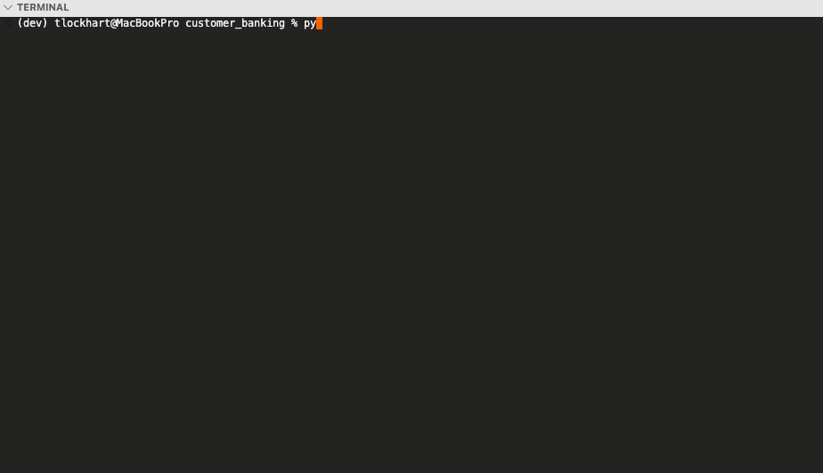

# Customer Banking System - Description

This program calculates and updates account balances with earned interest for both savings accounts and certificate of deposit (CD) accounts. It consists of a modular structure with separate files for account handling, savings account operations, CD account operations, and the main banking interface that coordinates these modules.

## Demo
<br/>

You can view a demo of the program in action, where it prompts the user for account details, calculates the earned interest, and displays the updated balances.

# Setup
The main entry point for the app is `customer_banking.py`. To run the application, ensure that Python v3.10 or later is installed on your system and follow the installation steps below.

## Installation Steps
1. **Clone the Repository**: Clone this repository to your local machine.
   ```bash
   git clone git@github.com:tlockhart/customer_banking.git

## Execute Program
1. Open your terminal, and execute the following commands in the root directory:
    1. python `customer_banking.py` [Enter]
    2. Follow the instructions at the command prompt
